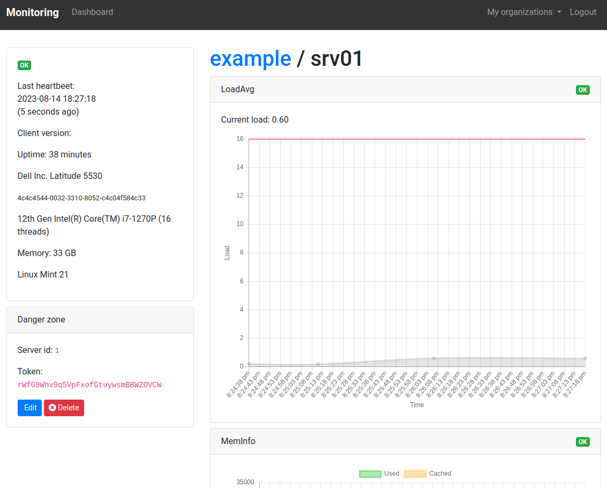

# Monitoring

[](https://gitlab.cylab.be/cylab/monitoring/-/commits/master)
[](https://gitlab.cylab.be/cylab/monitoring/-/commits/master)

A simple monitoring tool where monitored servers "push" their state to the monitoring interface.



## Contributing

The easiest way to run the development environment is using docker compose.

Once docker is installed, you can start the dev environment with

```bash
docker compose up
```

After a few seconds, the monitoring interface will be available at ```http://127.0.0.1:8080/```

The dev stack also includes mailhog, so you can inspect sent emails at ```http://127.0.0.1:8025```

You can check https://cylab.be/blog/190/run-a-development-environment-for-laravel-with-docker-compose for more info...
